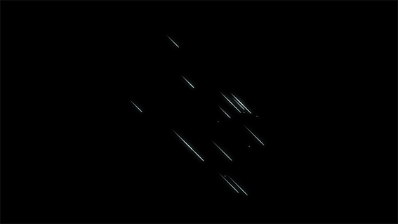
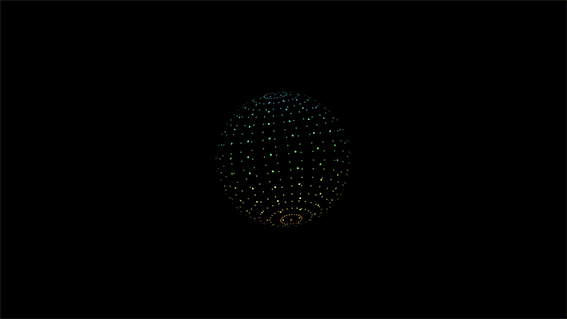

# :mag:Preview

## magic circle


## meteor effect


## particle effect


# :pencil2:Quick Start

1. Choose a theme, the document tree is shown as follows:

```
├── index.html
├── style.css
├── *.less
├── index.js
└── preview.gif
```
Note that ```*.less``` must be precompiled to ```*.css```.
Also you need to add ```jquery.min.js``` to root directory, or use CDN
```
<script src="https://cdn.bootcss.com/jquery/3.4.1/jquery.min.js"></script>
```
2. Install Upupoo and casually download a wallpaper, the path seems like ```./UpupooResource/"themeno"/```.

Then delete all the contents and copy the theme files into the folder.

3. Add ```theme.upup``` into the folder.

```
{
    "author":"",
    "description":"",
    "isOriginal":"",
    "name":"",
    "reprintUrl":"",
    "src":"index.html",
    "tag":"",
    "themeType":2,
    "themeno":"",
    "url":"",
    "ver":""
}
```
4. Reload Upupoo.